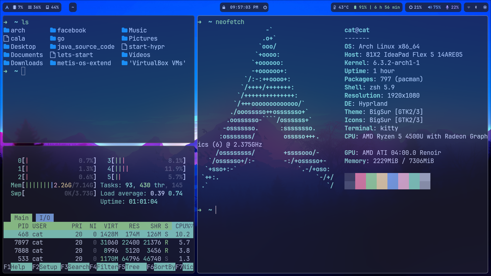
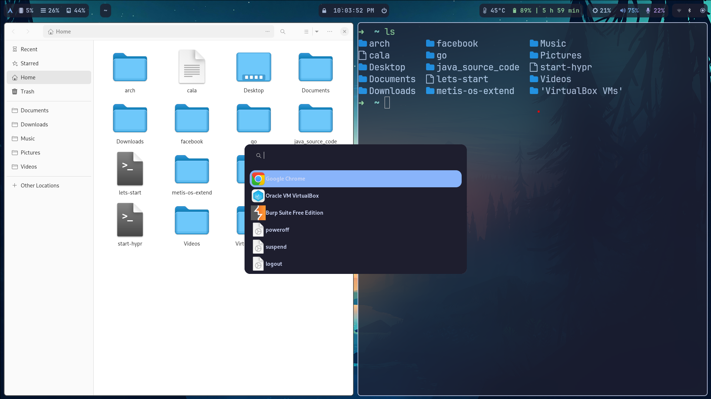
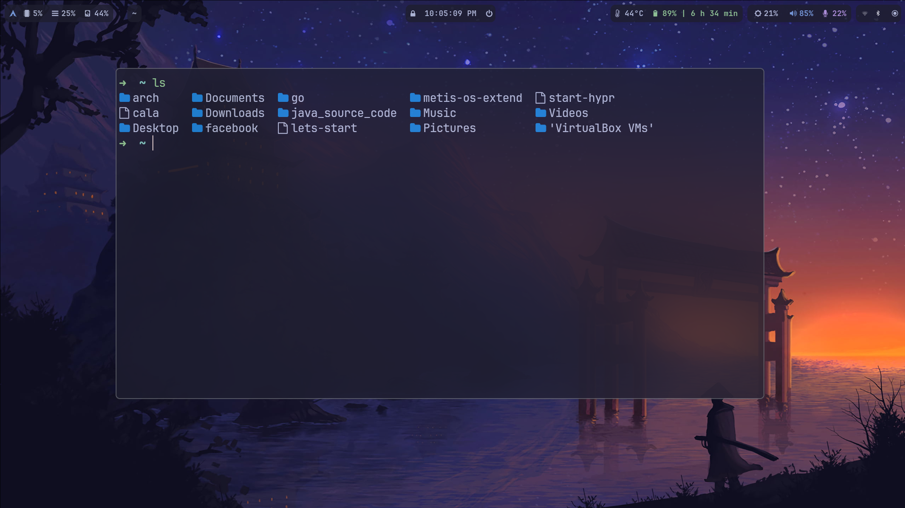

# arch iso building with github workflow using archiso tool


#### Building my own arch iso with hyprland as compositor for wayland and calamares as gui installer


### Features
- Fully working hyprland setup
- No need internet to install
- Installtion is pretty simple using script
- Just install and enjoy

you can download the latest release iso and try it out!

### It contains
- terminal (kitty)
- nautilus (file manager)
- hyprland (defintely)
- screenshot taker
- neovim setup (nvchad)
- zsh autosyntax highlighting/suggestions extension
- waybar for showing top bar
- notification software
- audio pipewire
- brightnessctl
- pactl for changing volume
- wifi/bluetooth connectivity with ui (networkmanager)
- document viewer like pdf,txt
- image viewer
- have everything of minimum
- chrome 
- vscode 
- vlc
- obs-studio
- gcc
- mounting of devices automatically
- more later


# Installation
-   ### boot the iso using bootable disk downloaded from release page of this repo

-   ### Edit the config file using this command
```bash
conf                       #a config file is opened in vim to change everything
```

It looks something like this to add everything like parition,user name,password etc

```json
{
    "efi_partition":"/dev/nvme0n1p1",
    "bios_bootloader_partition":"/dev/sda",
    "efi_format":"no",

    "bootloader_name":"HyprlandArch",
    "search_for_other_os":"no",


    "root_partition":"/dev/nvme0n1p2",
    "root_format":"yes",

    "separate_home":"no",
    "separate_home_partition":"",
    "separate_home_format":"no",

    "swap_partition":"",
    "swap_format":"no",

    "processor":"amd",

    "mount_dir":"/mnt",


    "hostname":"cat",
    "username":"cat",

    "user_password":"root",
    "root_password":"root"
}


```

-   ### Start the installtion using this command

```bash
start       #It will start installing the os
```
#### Thats all. Reboot the system and enjoy





### Keybings


- ModKey = SUPER


- SUPER F5  #brightness down
- SUPER F6   #brightntness up
- SUPER D #volume down
- SUPER F #volume up
- SUPER ESCAPE #lock screen
- SUPER G  #dark/light mode
- SUPER T # kitty open the terminal
- SUPER Q  # close the active window
- SUPER R  # show the logout window
- SUPER SHIFT, M  #Exit Hyprland all together no (force quit Hyprland)
- SUPER E  #nautilus Show the graphical file browser
- SUPER Y, togglefloating, # Allow a window to float
- SUPER SPACE, exec, wofi # Show the graphical app launcher
- SUPER U, pseudo, # dwindle
- SUPER B,exec, pkill waybar || waybar&, # dwindle
- SUPER O, togglesplit, # dwindle
- SUPER M, fullscreen,1 # dwindle
- SUPER C, exec, google-chrome-stable # dwindle
- SUPER V, exec, code  # dwindle
- SUPER F, exec, wallchanger  # dwindle
- SUPER S, exec, grim -g "$(slurp)" - | swappy -f - # take a screenshot

### Move focus with mainMod + arrow keys
- SUPER L, movefocus, l
- SUPER H, movefocus, r
- SUPER K, movefocus, u
- SUPER J, movefocus, d

### Switch workspaces with mainMod + [0-9]
- SUPER 1, workspace, 1
- SUPER 2, workspace, 2
- SUPER 3, workspace, 3
- SUPER 4, workspace, 4
- SUPER 5, workspace, 5
- SUPER 6, workspace, 6
- SUPER 7, workspace, 7
- SUPER 8, workspace, 8
- SUPER 9, workspace, 9
- SUPER 0, workspace, 10

#wallpapers
- SUPER SHIFT,1,exec, swww img ~/.wallpapers/0.jpg
### Move active window to a workspace with mainMod + SHIFT + [0-9]
- SUPER SHIFT, 1, movetoworkspace, 1
- SUPER SHIFT, 2, movetoworkspace, 2
- SUPER SHIFT, 3, movetoworkspace, 3
- SUPER SHIFT, 4, movetoworkspace, 4
- SUPER SHIFT, 5, movetoworkspace, 5
- SUPER SHIFT, 6, movetoworkspace, 6
- SUPER SHIFT, 7, movetoworkspace, 7
- SUPER SHIFT, 8, movetoworkspace, 8
- SUPER SHIFT, 9, movetoworkspace, 9
- SUPER SHIFT, 0, movetoworkspace, 10

### Scroll through existing workspaces with mainMod + scroll
- SUPER P, workspace, e+1
- SUPER I, workspace, e-1

### Move/resize windows with mainMod + LMB/RMB and dragging
- SUPER mouse:272, movewindow
- SUPER SHIFT, mouse:272, resizewindow


